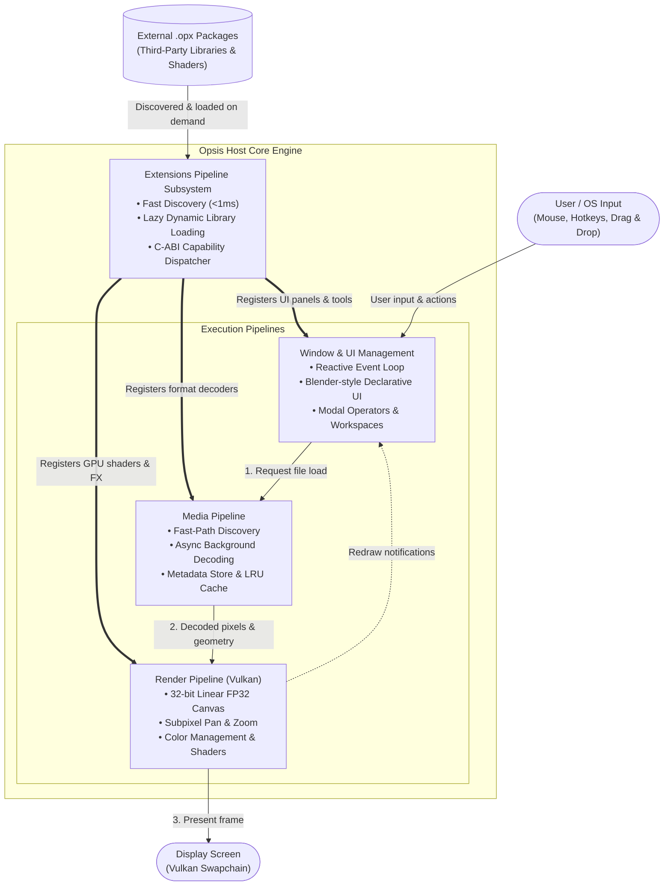

# Opsis Architecture Overview

**Opsis** is an ultra-fast, lightweight, and extensible media viewer designed for instant startup, zero background resource usage, and clean modularity.

---

## 1. System Structure

Opsis is organized into four core subsystems that work together to load, display, interact with, and extend media:

---

## 2. How the Subsystems Connect

1. **User Interaction & App Lifecycle ([Window & UI Management](Window%20and%20UI%20Management.md)):**
   
   * Listens for user input (mouse pan/zoom, hotkeys, file drag-and-drop).
   * Renders the minimal interface (clean canvas by default, toggleable header bar, tool shelf, and sidebar inspectors).
   * Whenever a new file is opened, it requests the **Media Pipeline** to load it.

2. **File Loading & Processing ([Media Pipeline](Media%20Pipeline.md)):**
   
   * Automatically identifies the file type and chooses the right decoder.
   * Decompresses images, animations, or 3D models on background worker threads so the interface never freezes.
   * Extracts metadata (dimensions, color profiles, camera tags) and sends the raw visual data directly to the **Render Pipeline**.

3. **GPU Display & Compositing ([Render Pipeline](Render%20Pipeline.md)):**
   
   * Uploads decoded pixels or 3D geometry straight to the GPU.
   * Handles smooth subpixel panning, zooming, color adjustments, and high-quality image filtering.
   * Redraws the screen only when the view changes or an animation is playing, consuming $0\%$ GPU/CPU when idle.

4. **Modular Multi-Component Add-ons ([Extensions Pipeline](Extensions%20Pipeline.md)):**
   
   * A single `.opx` package can bundle **native shared libraries** (for heavy decoders), **Python scripts** (for fast UI panels & tools), and **precompiled SPIR-V shaders** into one clean archive.
   * Discovers installed extensions instantly on boot ($< 1\text{ ms}$), loading native libraries or the Python runtime strictly on demand when an associated file format or panel is opened.

---

## 3. Subsystem Specifications

For detailed technical specifications, data contracts, and implementation architectures, refer to the individual documents:

* [Media Pipeline Specification](Media%20Pipeline.md): File discovery, async decoding, caching, metadata extraction, and decoder fuzz resiliency.
* [Render Pipeline Specification](Render%20Pipeline.md):GPU canvas rendering, color management, image filtering, 3D scenes, and strict performance budgets.
* [Window and UI Management Specification](Window%20and%20UI%20Management.md): Event handling, workspace layout, operators, UI panels, and portable configuration.
- [Extensions Pipeline Specification](Extensions%20Pipeline.md): Host-side plugin discovery, event bus (`FfiEventBus`), Safe Mode (`--safe-mode`), and dynamic linking.
* [Extension Specification & Authoring Guide](Extension%20Specification.md): Developer guide for authoring `.opx` packages with Python UI panels, native decoders, and SPIR-V shaders.
