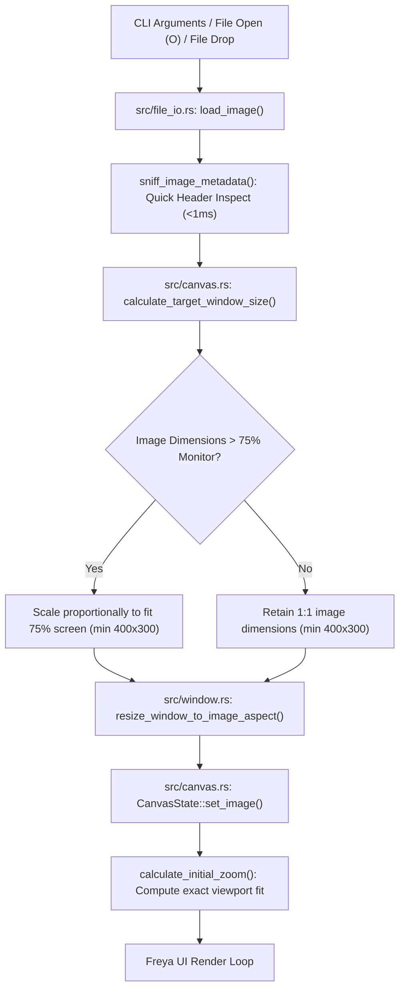
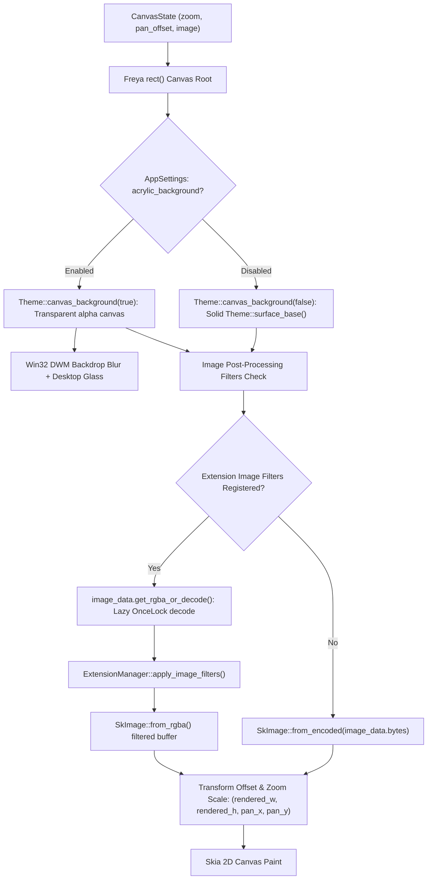
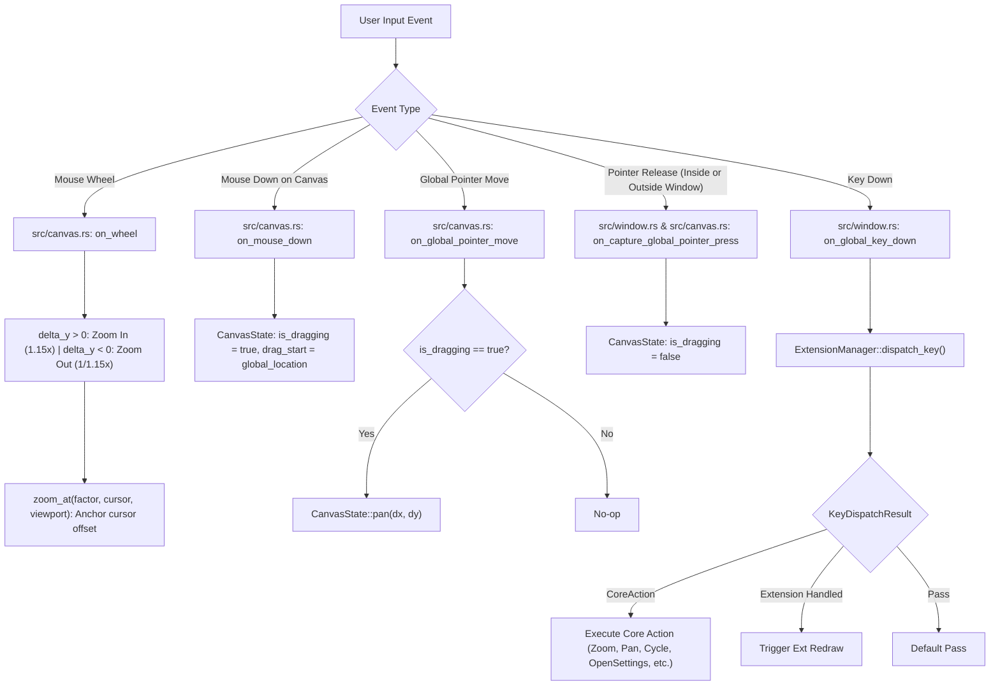
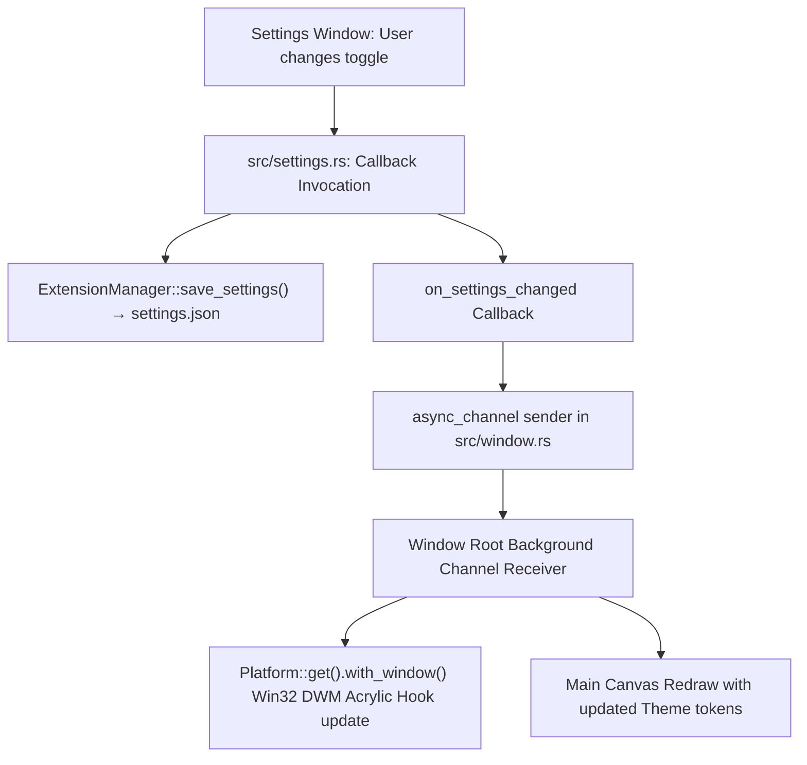

# Opsis Architecture Reference Manual

> **Purpose**: This document provides an exhaustive, structured architectural map of the **Opsis** codebase. AI coding agents and contributors should consult this document before exploring code files to pinpoint exact modules, types, functions, and dataflows with zero overhead.

---

## 1. System Overview & Architectural Philosophy

Opsis is an ultra-lightweight, portable, high-performance image viewer built with Rust, **Freya** (powered by Google Skia 2D rendering and Winit windowing), and a pure **Microkernel Extension-First Architecture**.

```
+-------------------------------------------------------------------------------+
|                               OPSIS WORKSPACE                                 |
+-------------------------------------------------------------------------------+
|  +-------------------------------------------------------------------------+  |
|  |                            src/ (Host Binary)                           |  |
|  |                                                                         |  |
|  |  +-------------------+  +-------------------+  +---------------------+  |  |
|  |  |   src/main.rs     |  |   src/window.rs   |  |    src/canvas.rs    |  |  |
|  |  |  CLI & Bootstrap  |  |   Window Host     |  |  Skia Canvas Engine |  |  |
|  |  +-------------------+  +-------------------+  +---------------------+  |  |
|  |                                                                         |  |
|  |  +-------------------+  +-------------------+  +---------------------+  |  |
|  |  |   src/file_io.rs  |  |   src/hotkeys.rs  |  |    src/config.rs    |  |  |
|  |  | Header Sniff/RGBA |  | Command Registry  |  | AppSettings (.json) |  |  |
|  |  +-------------------+  +-------------------+  +---------------------+  |  |
|  |                                                                         |  |
|  |  +-------------------+  +-------------------+  +---------------------+  |  |
|  |  |   src/manager.rs  |  |   src/bundle.rs   |  |    src/loader.rs    |  |  |
|  |  | Extension Manager |  | .opx ZIP Cache    |  | libloading Dynamic  |  |  |
|  |  +-------------------+  +-------------------+  +---------------------+  |  |
|  |                                                                         |  |
|  |  +-------------------------------------------------------------------+  |  |
|  |  |                       src/ui/ (Design System)                     |  |  |
|  |  |  theme.rs | components.rs | acrylic.rs | helpers.rs | mod.rs      |  |  |
|  |  +-------------------------------------------------------------------+  |  |
|  |                                                                         |  |
|  |  +-------------------+  +-------------------+                           |  |
|  |  |  src/settings.rs  |  |    src/log.rs     |                           |  |
|  |  |  Settings Window  |  |  Console Logging  |                           |  |
|  |  +-------------------+  +-------------------+                           |  |
|  +-------------------------------------------------------------------------+  |
|                                     |                                         |
|                                     | depends on                              |
|                                     v                                         |
|  +-------------------------------------------------------------------------+  |
|  |                 crates/opsis_extension_api (Public API)                 |  |
|  |  OpsisExtension | SidebarTabProvider | ActionHandler | ImageFilter...    |  |
|  +-------------------------------------------------------------------------+  |
+-------------------------------------------------------------------------------+
```

### Core Design Principles
1. **Microkernel Extension-First**: The core host binary contains zero hardcoded features, overlays, or visualization logic. The host acts purely as a capability broker and delegates all viewports, filters, overlays, sidebar tabs, and custom commands to modular plugins.
2. **Sub-Millisecond File Inspection**: Dimensions and formats are sniffed in under 1 ms directly from file header bytes without decoding pixel buffers. RGBA rasterization is lazily executed on-demand and cached via `OnceLock`.
3. **Decoupled Window Host**: Freya window lifecycle, Skia canvas rendering, and the native settings window are cleanly isolated without circular dependencies.
4. **Deterministic Reactive State**: All Freya/Dioxus `use_state` hooks are hoisted to top-level view functions to strictly guarantee deterministic hook ordering across conditional tab transitions.

---

## 2. Instant Subsystem Lookup Matrix (The "Where To Look" Table)

Use this table to immediately identify which files, structs, and functions to inspect or modify for common tasks:

| Feature / Task | Target Files | Key Structs & Functions | Relevant Tests |
| :--- | :--- | :--- | :--- |
| **Image Loading & Header Sniffing** | [`src/file_io.rs`](file:///C:/Users/felix/Documents/pi/Opsis/src/file_io.rs) | `load_image`, `sniff_image_metadata`, `LoadedImage`, `OnceLock` RGBA cache | `file_io::tests::test_load_image_and_on_demand_rgba` |
| **Folder Image Cycling & Navigation** | [`src/file_io.rs`](file:///C:/Users/felix/Documents/pi/Opsis/src/file_io.rs) | `get_adjacent_image_path`, `find_supported_images_in_dir`, `alphanumeric_sort` | `file_io::tests::test_find_images_and_adjacent_cycling` |
| **Canvas Zoom, Pan & Transformations** | [`src/canvas.rs`](file:///C:/Users/felix/Documents/pi/Opsis/src/canvas.rs) | `CanvasState`, `zoom_at`, `pan`, `calculate_initial_zoom`, `fit_to_window` | `canvas::tests::test_cursor_centered_zoom`, `test_pan_delta` |
| **Window Auto-Sizing (75% Monitor Bounds)** | [`src/canvas.rs`](file:///C:/Users/felix/Documents/pi/Opsis/src/canvas.rs), [`src/window.rs`](file:///C:/Users/felix/Documents/pi/Opsis/src/window.rs) | `calculate_target_window_size`, `resize_window_to_image_aspect` | `canvas::tests::test_calculate_target_window_size` |
| **Ambient Blur & Acrylic Glass Compositing** | [`src/ui/acrylic.rs`](file:///C:/Users/felix/Documents/pi/Opsis/src/ui/acrylic.rs), [`src/ui/theme.rs`](file:///C:/Users/felix/Documents/pi/Opsis/src/ui/theme.rs) | `render_ambient_blurred_backdrop`, `apply_windows_acrylic`, `Theme::canvas_background` | `ui::acrylic::tests::test_acrylic_config_and_render` |
| **Keyboard Shortcuts & Rebinding** | [`src/hotkeys.rs`](file:///C:/Users/felix/Documents/pi/Opsis/src/hotkeys.rs) | `CoreAction`, `KeybindingsConfig`, `dispatch_key`, `rebind_action`, `keybindings.json` | `hotkeys::tests::test_rebind_and_reset_action` |
| **Application Settings Persistence** | [`src/config.rs`](file:///C:/Users/felix/Documents/pi/Opsis/src/config.rs), [`src/manager.rs`](file:///C:/Users/felix/Documents/pi/Opsis/src/manager.rs) | `AppSettings` (`dark_mode`, `show_watermark`, `acrylic_background`), `settings.json` | `settings::tests::test_settings_panes_render` |
| **Settings Window & UI Panes** | [`src/settings.rs`](file:///C:/Users/felix/Documents/pi/Opsis/src/settings.rs) | `open_settings_window`, `settings_window_view`, `build_general_pane`, `build_appearance_pane`, `build_extensions_pane`, `build_shortcuts_pane` | `settings::tests::test_settings_panes_render` |
| **Modular UI Widget Library** | [`src/ui/components.rs`](file:///C:/Users/felix/Documents/pi/Opsis/src/ui/components.rs) | `button`, `switch`, `dropdown`, `card`, `expandable_card`, `table`, `text_field`, `file_dropzone`, `empty_state` | `ui::components::tests::test_buttons_and_controls_render` |
| **Theme Tokens & Semantic Colors** | [`src/ui/theme.rs`](file:///C:/Users/felix/Documents/pi/Opsis/src/ui/theme.rs) | `Theme::surface_base`, `Theme::surface_panel`, `Theme::accent_primary`, `Theme::ACRYLIC_ALPHA` | `ui::theme::tests::test_theme_colors_and_metrics` |
| **Extension Discovery & Dynamic Loading** | [`src/manager.rs`](file:///C:/Users/felix/Documents/pi/Opsis/src/manager.rs), [`src/bundle.rs`](file:///C:/Users/felix/Documents/pi/Opsis/src/bundle.rs), [`src/loader.rs`](file:///C:/Users/felix/Documents/pi/Opsis/src/loader.rs) | `ExtensionManager`, `load_in_background`, `unpack_opx_bundle`, `load_extension_dylib` | `manager::tests::test_manager_creation_and_discovery` |
| **Public Extension API Traits** | [`crates/opsis_extension_api/src/lib.rs`](file:///C:/Users/felix/Documents/pi/Opsis/crates/opsis_extension_api/src/lib.rs) | `OpsisExtension`, `SidebarTabProvider`, `ActionHandler`, `ImageFilterProvider`, `OverlayProvider`, `ViewportProvider`, `InputInterceptor` | `opsis_extension_api::tests::test_registry_registration` |
| **CLI Arguments & Logger Hierarchy** | [`src/log.rs`](file:///C:/Users/felix/Documents/pi/Opsis/src/log.rs), [`src/main.rs`](file:///C:/Users/felix/Documents/pi/Opsis/src/main.rs) | `LogLevel`, `log_canvas!`, `log_io!`, `log_window!`, `log_input!`, `log_ext!` | `log::tests::test_cli_argument_parsing` |

---

## 3. Visual End-to-End Dataflows

### 3.1 Startup & Image Loading Pipeline



### 3.2 Viewport Rendering & Skia Transformation Pipeline



### 3.3 Input Dispatching & Global Pointer Capture Pipeline



### 3.4 Settings Synchronization Pipeline



---

## 4. Module-by-Module Deep Dive

### 4.1 Host Entry & Window Host

- **[`src/main.rs`](file:///C:/Users/felix/Documents/pi/Opsis/src/main.rs)**:
  - Minimal microkernel bootstrap.
  - Parses CLI flags (`--debug`, `--trace`, `--quiet`, and optional startup image path).
  - Initializes logging hierarchy via [`src/log.rs`](file:///C:/Users/felix/Documents/pi/Opsis/src/log.rs).
  - Instantiates `Arc<Mutex<ExtensionManager>>` and hands off execution to `window::run()`.

- **[`src/window.rs`](file:///C:/Users/felix/Documents/pi/Opsis/src/window.rs)**:
  - Dedicated Window Host managing Freya window initialization (`LaunchConfig`, transparency, window icon, and close handlers).
  - `resize_window_to_image_aspect(img_dims)`: Uses monitor metrics from Winit to scale window dimensions to 75% of screen bounds.
  - Manages the `N`-Panel collapsible sidebar drawer with built-in tabs ("Details", "Tools", "Plugins") and dynamic extension tabs (`SidebarTabProvider`).
  - Spawns background worker channel for live extension reloading and settings synchronization.
  - Dispatches keyboard commands and universal global pointer capture (`on_capture_global_pointer_press`).

---

### 4.2 2D Canvas & Viewport Engine

- **[`src/canvas.rs`](file:///C:/Users/felix/Documents/pi/Opsis/src/canvas.rs)**:
  - Skia 2D rendering pipeline composite.
  - `CanvasState`:
    - `image: Option<LoadedImage>`: Active image buffer and metadata.
    - `zoom: f32`: Viewport scale factor (clamped between `0.02` and `50.0`).
    - `pan_offset: (f32, f32)`: Viewport panning displacement in pixels.
    - `is_dragging: bool` & `drag_start: (f64, f64)`: Mouse drag tracking state.
    - `error_message: Option<String>` & `last_file_path: Option<PathBuf>`: Corrupted payload presentation cards while preserving path for folder cycling.
  - `zoom_at(factor, cursor, viewport)`: Cursor-anchored zoom transformation formula:
    $$\Delta x = \text{cursor}_x - \frac{\text{viewport}_w}{2}, \quad \Delta y = \text{cursor}_y - \frac{\text{viewport}_h}{2}$$
    $$P_{x1} = \Delta x - k \cdot (\Delta x - P_{x0}), \quad P_{y1} = \Delta y - k \cdot (\Delta y - P_{y0})$$
  - `calculate_target_window_size(img_dims, screen_dims)`: Preserves image aspect ratio within 75% monitor bounds with minimum dimensions `(400.0, 300.0)`.
  - Integrates file drag-and-drop (`on_file_drop`) and post-processing extension filters (`apply_image_filters`).

---

### 4.3 File I/O, Decoding & Directory Cycling

- **[`src/file_io.rs`](file:///C:/Users/felix/Documents/pi/Opsis/src/file_io.rs)**:
  - `sniff_image_metadata(path)`: Sub-millisecond dimension and format parser inspecting magic bytes for PNG, JPEG, WebP, GIF, BMP, TIFF, ICO, QOI, AVIF, HDR, and TGA.
  - `LoadedImage`: Contains raw file `Bytes` and a thread-safe `Arc<OnceLock<Vec<u8>>>` RGBA cache. Raw image decoding is deferred until filters or pixel operations require uncompressed pixels.
  - `find_supported_images_in_dir(dir)`: Scans adjacent files and applies natural alphanumeric sorting (`alphanumeric_sort`).
  - `get_adjacent_image_path(current_path, forward)`: Resolves next/previous image for seamless folder navigation.
  - `pick_image_file()`: Native OS file picker dialog via `rfd`.

---

### 4.4 Hotkeys, Command Registry & Keybindings

- **[`src/hotkeys.rs`](file:///C:/Users/felix/Documents/pi/Opsis/src/hotkeys.rs)**:
  - `CoreAction`: Enum representing built-in actions:
    - `OpenImage`, `NextImage`, `PrevImage`, `ZoomIn`, `ZoomOut`, `ResetZoom`, `ToggleFitAxis`, `ToggleMaximize`, `ToggleSidebar`, `ToggleZenMode`, `ClearImage`, `OpenSettings`, `CloseWindow`.
  - `KeybindingsConfig`: Manages mappings between key strings (e.g., `"o"`, `"ArrowRight"`, `"F11"`) and actions.
  - Lazily persists custom key rebinding overrides to `keybindings.json` in the user's config directory (`~/.config/opsis/` or `%APPDATA%/opsis/`).
  - Supports extension-defined action definitions and handlers (`ActionDefinition`, `ActionHandler`).

---

### 4.5 Configuration System

- **[`src/config.rs`](file:///C:/Users/felix/Documents/pi/Opsis/src/config.rs)**:
  - `AppSettings`:
    - `dark_mode: bool`: UI theme mode (default: `true`).
    - `show_watermark: bool`: Show watermark logo when no image is loaded (default: `true`).
    - `acrylic_background: bool`: Enable native OS acrylic glass and Skia backdrop blur (default: `false`).
  - Automatically loads from and saves to `settings.json` in the user configuration directory via `directories-next`.

---

### 4.6 Extension Subsystem & Dynamic Loader

- **[`src/manager.rs`](file:///C:/Users/felix/Documents/pi/Opsis/src/manager.rs)**:
  - Discovers extensions in candidate folders: `<exe_dir>/extensions/` and user profile `~/.config/opsis/extensions/`.
  - Multi-threaded background loading via `load_in_background()` with redraw trigger callback.
  - Manages capability providers: `SidebarTabProvider`, `ActionHandler`, `ImageFilterProvider`, `OverlayProvider`, `ViewportProvider`, `InputInterceptor`.
- **[`src/bundle.rs`](file:///C:/Users/felix/Documents/pi/Opsis/src/bundle.rs)**:
  - Manages universal `.opx` ZIP bundles containing `manifest.json` and multi-architecture binaries inside `bin/<platform-key>/`.
  - Unpacks bundles into `.extension_cache/` and resolves the active platform library.
- **[`src/loader.rs`](file:///C:/Users/felix/Documents/pi/Opsis/src/loader.rs)**:
  - Zero-overhead dynamic library loader invoking `opsis_extension_create` over `libloading`.

---

### 4.7 UI Design System & Component Library

- **[`src/ui/theme.rs`](file:///C:/Users/felix/Documents/pi/Opsis/src/ui/theme.rs)**:
  - Centralized theme tokens: surface layers (`surface_base`, `surface_panel`, `surface_card`), semantic accents (`accent_primary`, `accent_muted`, `accent_hover`), text colors (`text_primary`, `text_secondary`, `text_muted`), borders (`border_subtle`, `border_focus`), and radii (`RADIUS_SM`, `RADIUS_MD`, `RADIUS_LG`).
  - Acrylic tokens: `ACRYLIC_ALPHA`, `ACRYLIC_TINT_RGB`, and `canvas_background(acrylic_enabled)`.
- **[`src/ui/components.rs`](file:///C:/Users/felix/Documents/pi/Opsis/src/ui/components.rs)**:
  - Reusable modular UI components:
    - `button()`, `button_primary()`, `button_secondary()`, `button_danger()`
    - `switch()`, `switch_row()`
    - `dropdown()`, `dropdown_row()`
    - `divider()`, `vertical_divider()`
    - `section()`, `section_header()`, `pane_header()`
    - `card()`, `card_row()`, `expandable_card()`
    - `file_dropzone()`, `empty_state()`
    - `key_badge()`, `status_pill()`, `info_row()`
    - `text_field()`, `text_field_row()` (hook-free, deterministic string input)
    - `table()`, `table_header()`, `table_row()`
- **[`src/ui/acrylic.rs`](file:///C:/Users/felix/Documents/pi/Opsis/src/ui/acrylic.rs)**:
  - Skia Gaussian ambient image backdrop renderer (`render_ambient_blurred_backdrop`).
  - Native Windows 11/10 DWM acrylic backdrop hook (`apply_windows_acrylic`):
    - `DwmExtendFrameIntoClientArea` margins `(-1, -1, -1, -1)` for seamless title bar glass.
    - `DWMWA_CAPTION_COLOR` & `DWMWA_TEXT_COLOR` synchronization.
    - `DWMWA_SYSTEMBACKDROP_TYPE = 3` (Acrylic).
- **[`src/ui/helpers.rs`](file:///C:/Users/felix/Documents/pi/Opsis/src/ui/helpers.rs)**:
  - Custom scrollbar metrics and dropdown popup layout calculators.

---

### 4.8 Native Settings Window

- **[`src/settings.rs`](file:///C:/Users/felix/Documents/pi/Opsis/src/settings.rs)**:
  - Standalone floating native OS window spawned via `open_settings_window(ext_mgr, on_settings_changed)`.
  - **Hook Hoisting Architecture**: Hoists all tab-level hooks (`expanded_items`, `status_banner`, `search_query`) to the root `settings_window_view` function to prevent hook count mismatch panics when switching tabs.
  - 5 Modular Panes:
    1. **General**: Visual controls, placeholder sample controls, restore defaults.
    2. **Appearance**: Dark theme switch, logo watermark toggle, acrylic background toggle, theme swatches.
    3. **Extensions**: Installed extension cards, expandable metadata details, `.opx` drag-and-drop installer.
    4. **Shortcuts**: Tabular keyboard shortcut listing, real-time search filtering, interactive key rebinding.
    5. **About**: Version information, architecture badges, repository links, license details.

---

## 5. Critical Agent Development Rules & Pitfalls

### Rule 1: Freya / Dioxus Rule of Hooks Safety
> [!CAUTION]
> In Freya / Dioxus, calling `.render()` / `.into()` on a struct implementing `Component` (e.g. `freya::components::Input` or `ScrollView`) executes hooks **inline** within the parent component's scope.
> - **NEVER** instantiate components with internal hooks inside conditional branches (`match current_tab { ... }` or `if condition { ... }`). Doing so alters the parent component's hook count dynamically and causes fatal `Hook count mismatch` / `Hook index out of bounds` panics.
> - **SOLUTION**: Always hoist reactive state hooks (`use_state`) to the root component function, or use hook-free layout primitives (built with `rect()` and `label()`).

### Rule 2: Universal Pointer Drag Release
> [!IMPORTANT]
> Standard `.on_mouse_up()` only triggers when the mouse button is released *inside* the element's bounding rect.
> - When implementing dragging or panning, always attach `.on_capture_global_pointer_press()` and `.on_global_pointer_press()` to guarantee that dragging state is safely reset even if the user releases the mouse outside the window.

### Rule 3: Win32 DWM Acrylic & Title Bar Frame Extension
> [!NOTE]
> To enable native translucent acrylic on Windows without an opaque black title bar:
> 1. Set window transparency to true (`.with_transparency(true)` and `.with_background(Color::TRANSPARENT)`).
> 2. Call `DwmExtendFrameIntoClientArea` with margins `(-1, -1, -1, -1)`.
> 3. Set `DWMWA_CAPTION_COLOR` to `0xFFFFFFFE` (`DWMWA_COLOR_DEFAULT`) to inherit the backdrop material across the caption area.

### Rule 4: Aspect-Ratio Sizing Bounds
> [!NOTE]
> When resizing the window to match an image:
> - Scale the window dimensions to fit within **75% of the active monitor's width and height**.
> - Enforce minimum window dimensions of `400x300` pixels.
> - Preserve fixed window dimensions during rapid folder navigation to avoid window flickering.

### Rule 5: Strict Append-Only Changelog Policy
> [!WARNING]
> When updating [`CHANGELOG.md`](file:///C:/Users/felix/Documents/pi/Opsis/CHANGELOG.md), **ONLY APPEND** new release notes to the end of the file. Existing version history must never be edited, truncated, or overwritten.

### Rule 6: Mandatory Extension API Docs Synchronization
> [!WARNING]
> Whenever modifying any trait, struct, or method in [`crates/opsis_extension_api`](file:///C:/Users/felix/Documents/pi/Opsis/crates/opsis_extension_api), you **MUST ALWAYS** update:
> 1. [`docs/EXTENSIONS.md`](file:///C:/Users/felix/Documents/pi/Opsis/docs/EXTENSIONS.md)
> 2. [`crates/opsis_extension_api/README.md`](file:///C:/Users/felix/Documents/pi/Opsis/crates/opsis_extension_api/README.md)

---

## 6. Verification & Build Commands

Always run these commands to verify codebase integrity before concluding tasks:

```powershell
# Check workspace compilation
cargo check --workspace

# Run complete unit test suite (37+ tests)
cargo test --workspace

# Run Clippy linter
cargo clippy --workspace

# Run Opsis application
cargo run

# Build optimized release binaries
cargo build --release
```
