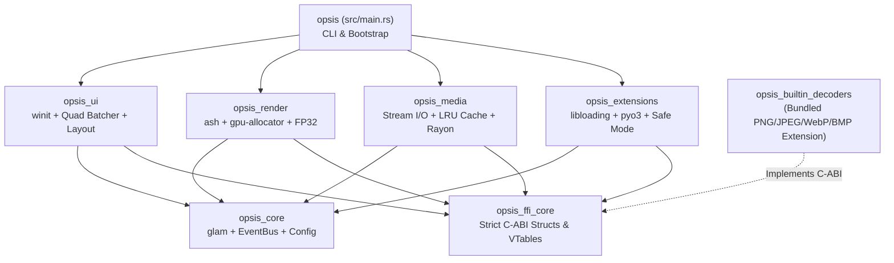

# Architecture & Technology Stack Specification

This document provides the definitive **Cargo Workspace Topology, Crate Breakdown, and Technology Stack Matrix** for Opsis. It serves as the engineering blueprint for implementing the engine without ambiguity.

---

## 1. Cargo Workspace Topology

Opsis is architected as a modular Cargo Workspace with strict unidirectional dependency boundaries:



### 1.1 Directory Structure

```
Opsis/
├── Cargo.toml                     # Root workspace manifest
├── Cargo.lock
├── crates/
│   ├── opsis_ffi_core/            # Strict C-ABI structs, FfiSlice, VTables, opsis_plugin_init
│   ├── opsis_core/                # Shared math (glam), EventBus, config, error types
│   ├── opsis_media/               # Fast-path sniffer, async decoders, LRU cache (moka)
│   ├── opsis_render/              # Vulkan backend (ash, gpu-allocator), swapchain, FP32 canvas
│   ├── opsis_ui/                  # Windowing (winit), declarative UILayout, modal operators
│   ├── opsis_extensions/          # Dynamic loader (libloading), pyo3 runner, Safe Mode
│   ├── opsis_builtin_decoders/    # Bundled basic decoder plugin (PNG, JPEG, WebP, BMP, ICO)
│   └── opsis_plugin_sdk/          # High-level ergonomic Rust SDK for writing .opx plugins
├── src/                           # Main binary entry point (opsis executable, CLI args)
├── shaders/                       # Source GLSL shaders & precompiled SPIR-V binaries
│   ├── compile_shaders.py
│   ├── canvas_fp32.frag
│   └── canvas_fp32.vert
└── build.rs                       # Offline SPIR-V build verification & Windows icon embedding
```

---

## 2. Crate Breakdown & Responsibilities

### 2.1 `opsis_ffi_core` (Canonical C-ABI Layer)
* **Purpose:** Pure, dependency-free C-compatible data structures, VTables, error codes, and slices.
* **Dependencies:** `None` (pure `std`).
* **Tooling:** Uses `cbindgen = "0.27"` to generate the canonical C/C++ header `opsis_ffi_core.h`.
* **Key Types:** `FfiSlice`, `FfiPluginManifest`, `FfiDecoderPlugin`, `FfiEventBusVTable`, `FfiLayoutContext`, `FfiOperatorDescriptor`, `FfiErrorCode`.

### 2.2 `opsis_core` (Shared Primitives & State)
* **Purpose:** High-performance SIMD math, shared configuration models, and host-internal pub/sub event bus.
* **Dependencies:**
  - `glam = { version = "0.29", features = ["bytemuck"] }` (16-byte aligned SIMD math)
  - `bytemuck = { version = "1.18", features = ["derive"] }` (Zero-copy byte casting for GPU upload)
  - `serde = { version = "1.0", features = ["derive"] }` & `serde_json = "1.0"` (Config serialization)
  - `parking_lot = "0.12"` (Low-overhead synchronization primitives)
  - `thiserror = "1.0"` (Deterministic error handling)

### 2.3 `opsis_render` (Vulkan Graphics Engine)
* **Purpose:** Raw Vulkan 1.3 rendering backend, sub-allocated GPU memory, swapchain management, and linear FP32 canvas.
* **Dependencies:**
  - `ash = "0.38"` (Direct, zero-overhead Vulkan bindings)
  - `gpu-allocator = { version = "0.27", default-features = false, features = ["vulkan"] }` (Fast sub-allocated VRAM pool)
  - `bytemuck = "1.18"` (Push constants and uniform packing)
  - `opsis_core`, `opsis_ffi_core`

### 2.4 `opsis_ui` (Windowing, Declarative Layout & Quad Batcher)
* **Purpose:** Window surface management, Blender-style `UILayout` tree, immediate-mode quad batching, font rasterization, and modal operator lifecycle.
* **Dependencies:**
  - `winit = "0.30"` (Cross-platform windowing, subpixel DPI, drag-and-drop)
  - `fontdue = "0.9"` (Ultra-fast SIMD font rasterizer, $< 0.1\text{ ms}$ per glyph)
  - `windows-sys = { version = "0.59", features = ["Win32_Graphics_Dwm", "Win32_UI_WindowsAndMessaging"] }` (Windows DWM Mica / Acrylic blur)
  - `opsis_core`, `opsis_render`, `opsis_ffi_core`

### 2.5 `opsis_media` (Media Streaming, Registry & Caching)
* **Purpose:** $O(1)$ fast-path header sniffer, asynchronous decompression worker pool, dynamic metadata store, and LRU cache.
* **Dependencies:**
  - `rayon = "1.10"` (Work-stealing CPU worker pool for decoders)
  - `crossbeam-channel = "0.5"` (Zero-allocation lock-free worker queues)
  - `moka = { version = "0.12", features = ["sync"] }` (Concurrent, thread-safe LRU byte eviction cache)
  - `opsis_core`, `opsis_ffi_core`

### 2.6 `opsis_extensions` (Dynamic Package Host & Scripting)
* **Purpose:** `.opx` package discovery, dynamic library linking under `std::panic::catch_unwind`, Safe Mode isolation, and lazy Python runtime.
* **Dependencies:**
  - `libloading = "0.8"` (Dynamic library `.dll`/`.so`/`.dylib` loader)
  - `zip = { version = "2.2", default-features = false, features = ["deflate"] }` (`.opx` archive extractor)
  - `pyo3 = { version = "0.22", optional = true }` (Lazy-loaded embedded Python 3 runtime)
  - `sha2 = "0.10"` (Cryptographic checksum verification for native binaries)
  - `opsis_core`, `opsis_ffi_core`

### 2.7 `opsis_builtin_decoders` (Bundled Basic Decoders Extension)
* **Purpose:** Bundled extension providing the baseline decoders (PNG, JPEG, WebP, BMP, ICO) across the canonical `FfiDecoderPlugin` C-ABI.
* **Dependencies:**
  - `zune-jpeg = "0.4"` (Fastest SIMD-accelerated JPEG decoder)
  - `image = { version = "0.25", default-features = false, features = ["png", "webp", "bmp", "ico"] }`
  - `opsis_ffi_core`

### 2.8 `opsis` (Root Executable Binary — `src/main.rs`)
* **Purpose:** CLI argument parsing (`--safe-mode`, `--no-plugins`, file paths), system bootstrap, and event loop orchestration.
* **Dependencies:**
  - `clap = { version = "4.5", features = ["derive"] }` (CLI flag parser)
  - `tracing = "0.1"` & `tracing-subscriber = "0.3"` (High-performance diagnostic logging)
  - `opsis_core`, `opsis_render`, `opsis_ui`, `opsis_media`, `opsis_extensions`

---

## 3. Technology Stack Selection Matrix

| Subsystem | Selected Library | Version | Technical Rationale |
| :--- | :--- | :--- | :--- |
| **Windowing & Input** | `winit` | `0.30` | Cross-platform event loop, multi-windowing, raw mouse events, drag-and-drop. |
| **Vulkan Bindings** | `ash` | `0.38` | Direct 1-to-1 Vulkan API mapping with zero overhead. Essential for $<15\text{ ms}$ cold start. |
| **GPU Memory Allocator** | `gpu-allocator` | `0.27` | Sub-allocates Vulkan memory chunks to eliminate runtime allocation stalls. |
| **Math & Transforms** | `glam` | `0.29` | 16-byte aligned SIMD linear algebra types with native `bytemuck` zero-copy cast support. |
| **Decompression Workers** | `rayon` + `crossbeam-channel` | `1.10` / `0.5` | Lightweight CPU work-stealing pool; zero async runtime overhead; $0.0\%$ idle CPU utilization. |
| **LRU Memory Cache** | `moka` | `0.12` | High-throughput concurrent LRU cache with fine-grained byte footprint eviction limits. |
| **SIMD Font Engine** | `fontdue` | `0.9` | Extremely fast font rasterizer ($< 0.1\text{ ms}$ per glyph), avoiding heavy layout engines. |
| **Dynamic Plugin Linking** | `libloading` | `0.8` | Cross-platform dynamic library loader (`LoadLibrary` / `dlopen`) with panic boundary isolation. |
| **Python Scripting Engine** | `pyo3` | `0.22` | Lazy-loaded embedded Python 3 runtime; initialized strictly on demand. |
| **Basic Image Decoding** | `zune-jpeg` + `image` | `0.4` / `0.25` | `zune-jpeg` delivers unmatched SIMD JPEG decode throughput; scoped `image` handles PNG/WebP/BMP. |
| **CLI & Flag Parsing** | `clap` | `4.5` | Fast command-line interface for `--safe-mode`, `--no-plugins`, and file path inputs. |
| **Settings & Serializer** | `serde` + `serde_json` | `1.0` | Sparse overlay deserialization for portable configuration. |

---

## 4. Concurrency & Execution Model

* **Dedicated Thread Separation:**
  - **Main Thread (UI & Event Loop):** Drives `winit` event pumping, declarative `UILayout` generation, operator modal loops, and Vulkan frame presentation.
  - **Worker Thread Pool (`rayon`):** Runs CPU-bound format decompression, header sniffing, and pixel unpacking asynchronously.
* **Lock-Free Communication:** Worker threads communicate with the main thread via `crossbeam_channel::unbounded()`, emitting lightweight decoded layer pointers without blocking the main event loop.
* **Cooperative Cancellation:** Background decoding tasks poll `FfiContext::is_cancelled` during decompression stages to immediately abort stale decode requests when users quickly scrub through images.
* **Zero Idle Footprint:** When no user inputs occur, no animations are playing, and background decode tasks are idle, worker threads sleep on OS condition variables, resulting in **$0.0\%$ CPU load and $0.0\%$ GPU utilization**.
